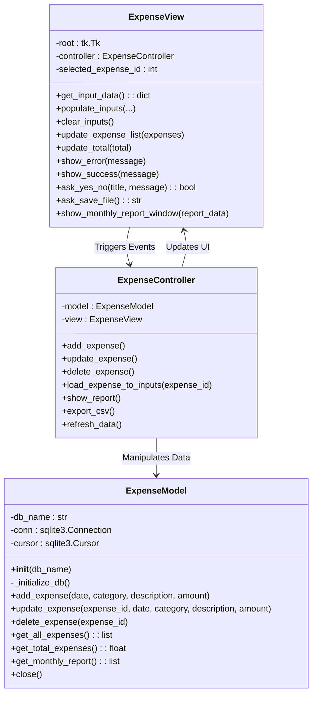
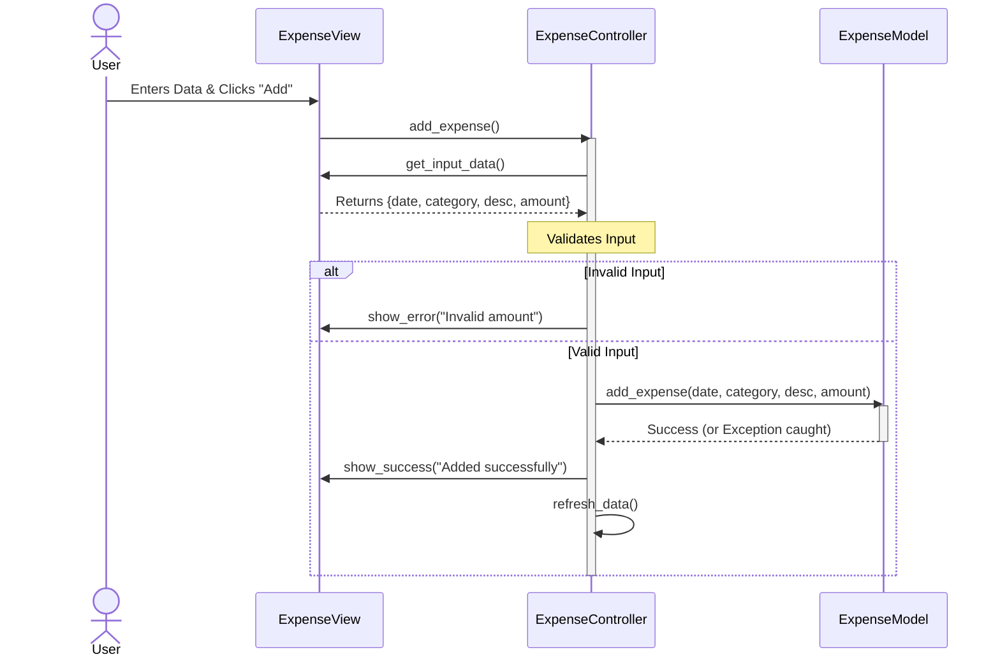
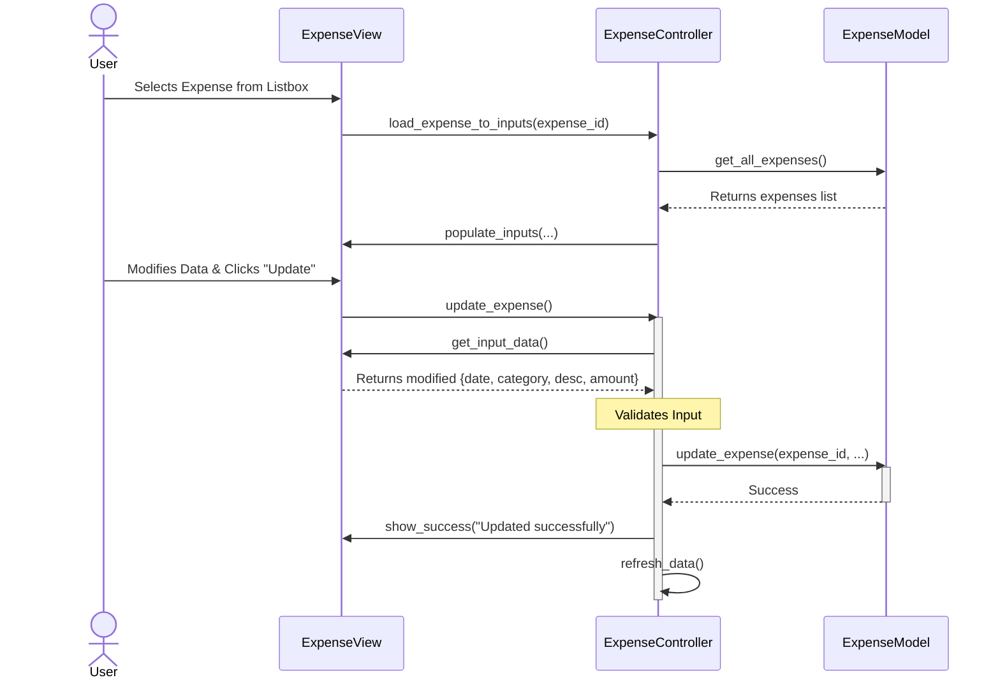
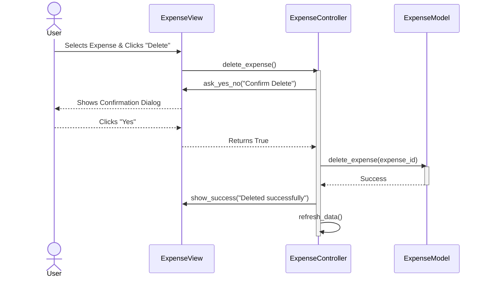
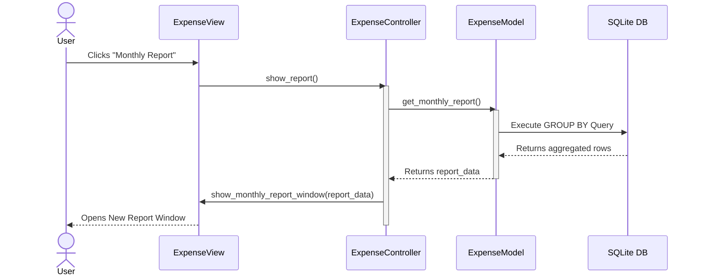
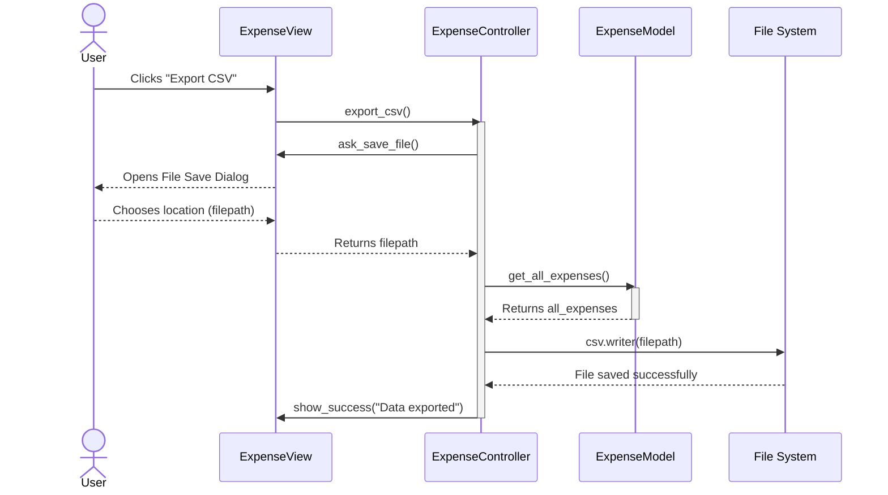

# Expense Tracker - Comprehensive UML Diagrams

This document provides professional UML (Unified Modeling Language) diagrams. It includes the overall system architecture and breaks down the system behavior into individual diagrams for **each Functional Requirement (FR)**.

---

## 1. System Architecture (Class Diagram)

The Class Diagram visualizes the static structure of the system, specifically highlighting the **Model-View-Controller (MVC)** design pattern.

---

## 2. Functional Requirements (Sequence Diagrams)

Below are the individual sequence diagrams for each functional requirement, demonstrating the precise data flow and interactions between the MVC components.

### FR-01: Add Expense
Allows the user to input data and save a new expense to the database.

---

### FR-02: Update Expense
Allows the user to select an existing expense, modify its details, and save the changes.

---

### FR-03: Delete Expense
Allows the user to select an expense and permanently remove it from the system.

---

### FR-04: View Monthly Report
Generates and displays an aggregated report of expenses grouped by month and category.

---

### FR-05: Export to CSV
Allows the user to export all current records to an external CSV file.

