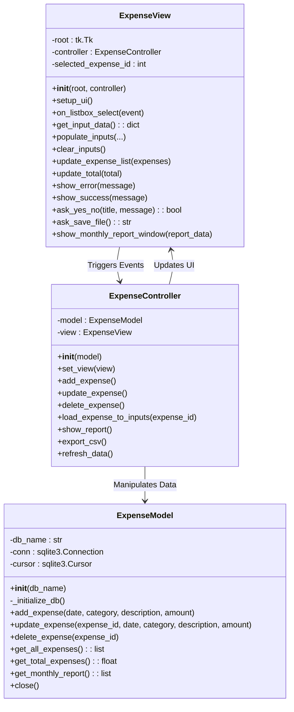
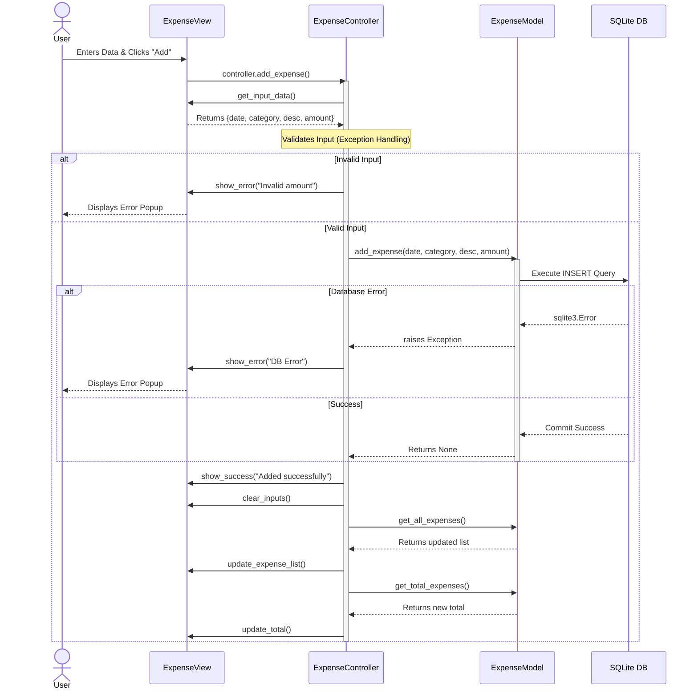

# Expense Tracker - UML Diagrams & Architecture

This document provides professional UML (Unified Modeling Language) diagrams to illustrate the architecture, structure, and behavior of the Expense Tracker application. These diagrams are crucial for Software Construction and Development (SDC) documentation.

---

## 1. Class Diagram (Architecture)

The Class Diagram visualizes the static structure of the system, specifically highlighting the **Model-View-Controller (MVC)** design pattern used in the refactoring phase.



### Explanation:
- **`ExpenseModel`**: Directly handles the SQLite database. It encapsulates all SQL queries (`INSERT`, `UPDATE`, `DELETE`, `SELECT`) and ensures robust exception handling.
- **`ExpenseView`**: Handles the Tkinter graphical user interface. It captures user inputs and triggers methods in the Controller.
- **`ExpenseController`**: Acts as the intermediary. It retrieves data from the View, validates it, passes it to the Model, and then tells the View to refresh itself with the updated data.

---

## 2. Use Case Diagram (System Behavior)

The Use Case diagram describes what the system does from the perspective of an external actor (the User).

```mermaid
usecaseDiagram
    actor User

    rectangle "Expense Tracker System" {
        usecase "Add Expense" as UC1
        usecase "Update Expense" as UC2
        usecase "Delete Expense" as UC3
        usecase "View Monthly Report" as UC4
        usecase "Export Data to CSV" as UC5
        usecase "Validate Input" as UC6
        usecase "Handle Database Error" as UC7
    }

    User --> UC1
    User --> UC2
    User --> UC3
    User --> UC4
    User --> UC5

    UC1 ..> UC6 : <<includes>>
    UC2 ..> UC6 : <<includes>>
    UC1 ..> UC7 : <<extends>>
    UC2 ..> UC7 : <<extends>>
    UC3 ..> UC7 : <<extends>>
```

### Explanation:
- **Primary Actors**: The user interacts with the core functionalities (Add, Update, Delete, View Report, Export).
- **Includes (`<<includes>>`)**: Whenever an expense is added or updated, the system *must* validate the input (e.g., ensuring the amount is a valid positive number).
- **Extends (`<<extends>>`)**: Database errors *might* happen during CRUD operations. If they do, the Exception Handling mechanism extends the use case to safely manage the error without crashing.

---

## 3. Sequence Diagram (Data Flow)

The Sequence Diagram illustrates how objects interact with each other in a sequential order. Below is the sequence for the **Add Expense** operation.



### Explanation:
1. **User Interaction**: The user initiates the process via the GUI (`ExpenseView`).
2. **Controller Logic**: `ExpenseController` requests the data, validates it, and decides what to do.
3. **Model Interaction**: If validation passes, it asks `ExpenseModel` to save the data. The Model communicates with the SQLite database.
4. **Feedback Loop**: Once the Model succeeds, the Controller tells the View to show a success message, clear the input boxes, and fetch the newly updated list and total to refresh the screen.
