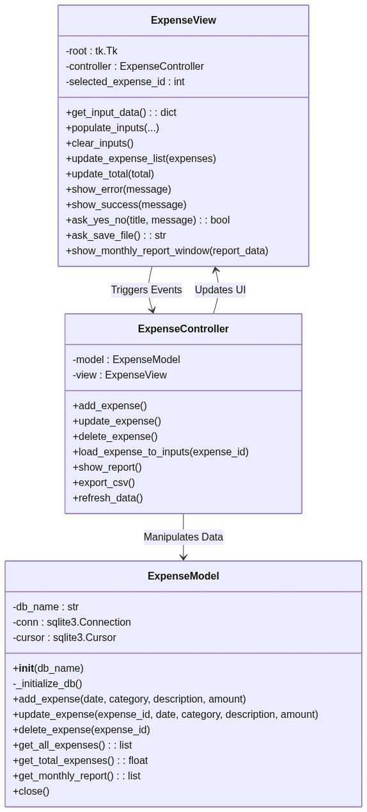
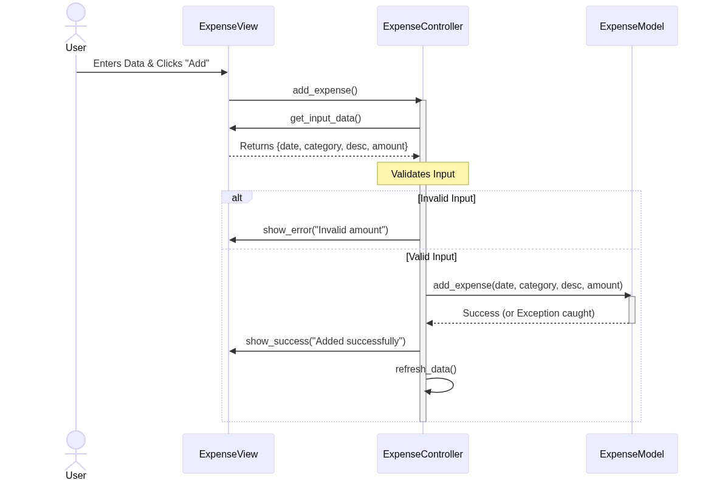
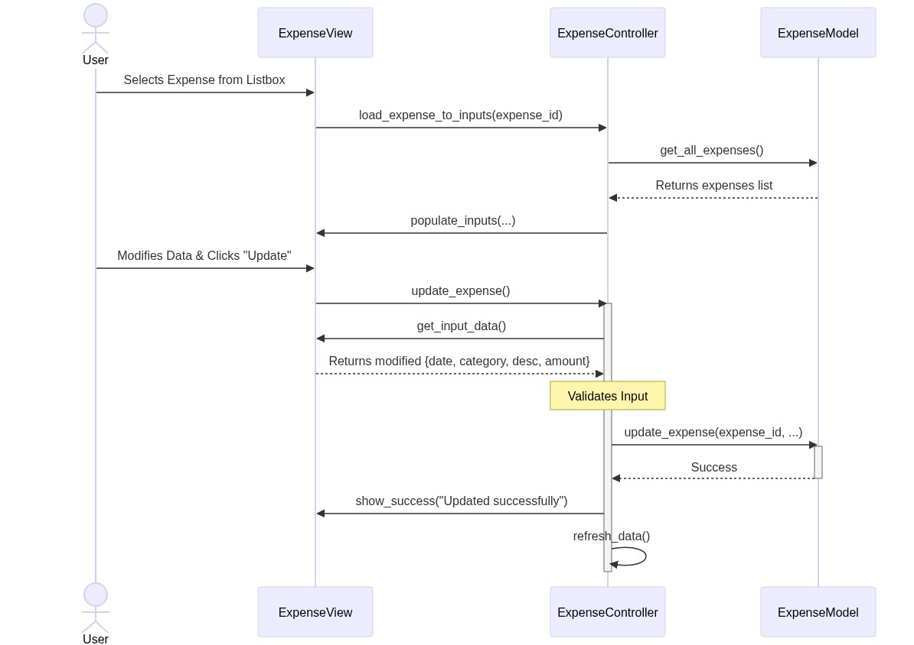
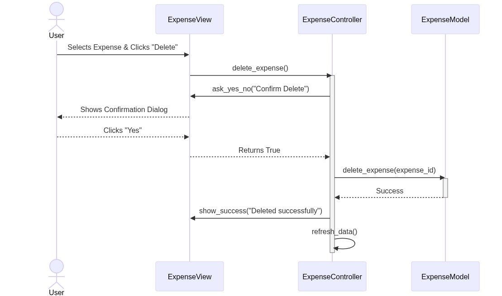
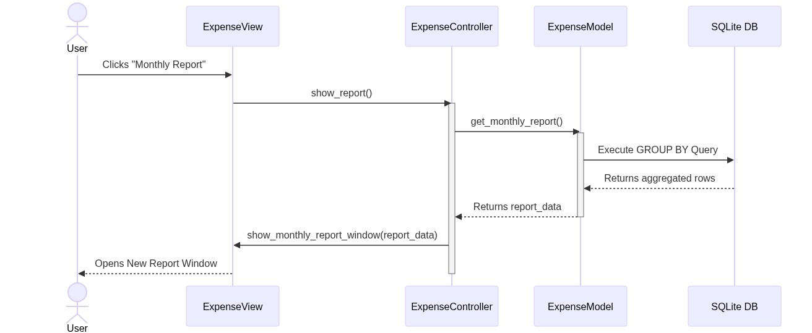
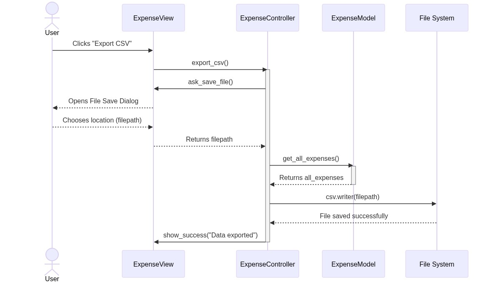

# Expense Tracker - Visual UML Diagrams

This document contains the actual generated `.png` image files of the UML diagrams, which you can easily drag and drop into your presentation or Word document report!

## 1. System Architecture (Class Diagram)

## 2. Functional Requirements (Sequence Diagrams)

### FR-01: Add Expense

### FR-02: Update Expense

### FR-03: Delete Expense

### FR-04: View Monthly Report

### FR-05: Export to CSV

